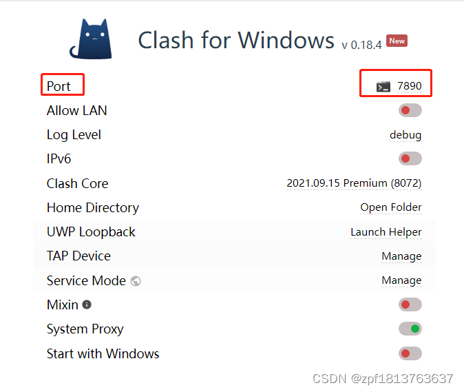
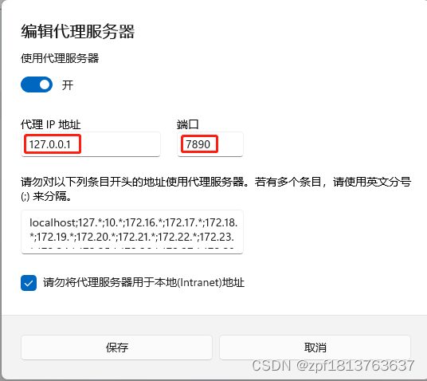

# Github提交403错误
2023.12.23

## 配置http代理Windows、Linux、Mac OS 中 git 命令相同：

你的项目肯定在一个文件夹内，在此文件夹内，右键git bash（前提你自己已经本地安装配置好git了）
输入git init，则此文件夹内会生成一个 .git文件夹，此时说明你这个项目的文件已经被控制了


```bash
git add test.php（随便一个你的文件）
git commit -m "第一次提交" //注释说明
git remote add origin https://github.com/***/VSCode_Git_Test.git （orgin是远程名称，url是github仓库地址）
git push -u origin master  //提交到你的仓库, master分支
```

```
libpng warning: iCCP: cHRM chunk does not match sRGB
Enumerating objects: 5, done.
Counting objects: 100% (5/5), done.
Delta compression using up to 16 threads
Compressing objects: 100% (3/3), done.
Writing objects: 100% (5/5), 447 bytes | 447.00 KiB/s, done.
Total 5 (delta 0), reused 0 (delta 0), pack-reused 0
remote:
remote: Create a pull request for 'master' on GitHub by visiting:
remote:      https://github.com/victolapan/Data-Mining-Test/pull/new/master
remote:
To https://github.com/victolapan/Data-Mining-Test.git
 * [new branch]      master -> master
branch 'master' set up to track 'origin/master'.
```

Git报错： Failed to connect to github.com port 443
+ 配置socks5代理
```bash
git config --global http.proxy socks5 127.0.0.1:7890
git config --global https.proxy socks5 127.0.0.1:7890
```

+ 配置http代理
```bash
git config --global http.proxy 127.0.0.1:7890
git config --global https.proxy 127.0.0.1:7890
```

注意：
命令中的主机号（127.0.0.1）是使用的代理的主机号(自己电脑有vpn那么本机可看做访问github的代理主机)，即填入127.0.0.1即可，否则填入代理主机 ip(就是网上找的那个ip)
命令中的端口号（7890）为代理软件(代理软件不显示端口的话，就去Windows中的代理服务器设置中查看)或代理主机的监听IP，可以从代理服务器配置中获得，否则填入网上找的那个端口port 




socks5和http两种协议由使用的代理软件决定，不同软件对这两种协议的支持有差异，如果不确定可以都尝试一下
主机号和端口号可在代理的位置查看(自己有vpn的需要查看)




查看代理命令
```bash
git config --global --get http.proxy
git config --global --get https.proxy
```

取消代理命令

```bash
git config --global --unset http.proxy
git config --global --unset https.proxy
```